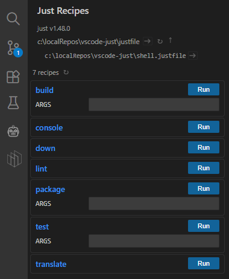

# vscode-just

[](https://github.com/revodatanl/vscode-for-just/blob/main/LICENSE)
[](https://github.com/revodatanl/vscode-for-just/actions/workflows/ci.yml)
[](https://marketplace.visualstudio.com/items?itemName=RevoData.vscode-for-just)
[](https://gitmoji.dev)

Full-featured [just](https://github.com/casey/just) (justfile) support for Visual Studio Code. Built and maintained by [RevoData](https://github.com/revodatanl).

## Features

### Syntax highlighting

TextMate grammar-based highlighting for justfiles, including:

- Recipe definitions, attributes, parameters, and dependencies
- Variable assignments, settings, and exports
- Strings, interpolation blocks (`{{ }}`), and backtick expressions
- Keywords, constants, and operators
- Comments (line and block)

### Embedded languages

Syntax highlighting for recipe bodies written in:

- Shell / Bash
- Python
- JavaScript
- TypeScript
- Ruby
- Perl

### Language Server (LSP)

Integration with [just-lsp](https://github.com/terror/just-lsp) for diagnostics, completions, and more. The extension checks for the `just-lsp` binary and prompts for installation if missing. LSP can be toggled via settings.

### Formatter

Format-on-save support powered by `just --dump`. Works with unsaved editor content via temp files and correctly resolves relative imports by running in the original file's directory.

### Recipe runner

Run any recipe directly from VS Code:

- **Quick pick**: `Just: Run Recipe` command lists all public recipes with docs and group labels, prompts for arguments
- **Sidebar explorer**: a dedicated activity bar panel that displays all recipes grouped by `[group]` attributes, with inline parameter inputs and one-click run buttons

### Task provider

Registers a `vscode-just` task type so recipes appear in the built-in **Tasks: Run Task** picker and can be referenced in `tasks.json`.

## Example



## Configuration

All settings are under the `vscode-just` namespace:

| Setting | Type | Default | Description |
|---|---|---|---|
| `justPath` | `string` | `just` | Path to the `just` binary |
| `lspPath` | `string` | `just-lsp` | Path to the `just-lsp` binary |
| `enableLsp` | `boolean` | `true` | Enable/disable the Language Server |
| `runInTerminal` | `boolean` | `false` | Run recipes in a terminal instead of the output channel |
| `useSingleTerminal` | `boolean` | `false` | Reuse a single terminal for all recipe runs |
| `logLevel` | `string` | `info` | Log level: `info`, `warning`, `error`, `none` |

## Installation

### Marketplace

- [VS Code Marketplace](https://marketplace.visualstudio.com/items?itemName=RevoData.vscode-for-just)
- [Open VSX](https://open-vsx.org/extension/RevoData/vscode-for-just)

### Manual

- Download the `.vsix` from the latest [release](https://github.com/revodatanl/vscode-for-just/releases).

Or

- Install via CLI:

    ```shell
    code --install-extension vscode-for-just-X.Y.Z.vsix
    ```

## Known issues

### Nesting and scoping

TextMate grammars lack full parser capabilities, which leads to a few known limitations:

- **Keyword bleed**: expression-level rules (e.g. `if`) apply globally, including inside recipe bodies, because we cannot scope by indentation.
- **Nested braces**: deeply nested or escaped braces inside interpolations may match prematurely. For example `{{ '{{ string }}' }}` will break because the grammar matches the first closing `}}`.
- **Multi-line expressions**: line continuations (`\`) and expressions spanning multiple lines may not highlight correctly.

These are inherent to TextMate and not easily fixable without a full parser.

## Contributing

See [CONTRIBUTING.md](CONTRIBUTING.md).

## References

- [Just manual](https://just.systems/man/en/)
- [Packaging and publishing extensions](https://code.visualstudio.com/api/working-with-extensions/publishing-extension)
